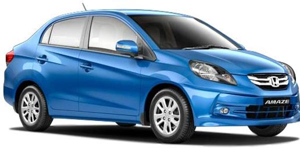
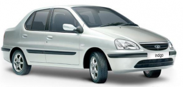

<!doctype html>
<html class="no-js" lang="en">
    
<!-- Mirrored from themebeyond.com/html/agrifram/agrifram/index.html by HTTrack Website Copier/3.x [XR&CO'2014], Sat, 10 Oct 2020 13:01:26 GMT -->

<!-- Mirrored from varanasitravelagency.com/index.html by HTTrack Website Copier/3.x [XR&CO'2014], Thu, 21 Jul 2022 12:46:59 GMT -->

<!-- Mirrored from varanasitravelagency.com/index-2.html by HTTrack Website Copier/3.x [XR&CO'2014], Wed, 22 May 2024 16:03:54 GMT -->
<head>
        <meta charset="utf-8">
        <meta http-equiv="x-ua-compatible" content="ie=edge">
        <title>Google Texi Services </title>
        <meta name="description" content="">
        <meta name="viewport" content="width=device-width, initial-scale=1">
          <meta name="keywords" content="Cab Services in Varanasi, Taxi in Varanasi, Google Cab, Book taxi in Varanasi, Airports Cab in varanasi">
    
		<link rel="shortcut icon" type="image/x-icon" href="img/favicon.png">
        <!-- Place favicon.ico in the root directory -->

		<!-- CSS here -->
        <link rel="stylesheet" href="css/bootstrap.min.css">
        <link rel="stylesheet" href="css/animate.min.css">
        <link rel="stylesheet" href="css/magnific-popup.css">
        <link rel="stylesheet" href="css/fontawesome-all.min.css">
        <link rel="stylesheet" href="css/owl.carousel.min.css">
        <link rel="stylesheet" href="css/odometer.css">
        <link rel="stylesheet" href="css/jquery-ui.css">
        <link rel="stylesheet" href="css/flaticon.css">
        <link rel="stylesheet" href="css/aos.css">
        <link rel="stylesheet" href="css/slick.css">
        <link rel="stylesheet" href="css/default.css">
        <link rel="stylesheet" href="css/style.css">
        <link rel="stylesheet" href="css/responsive.css">
	 <link rel="stylesheet" href="social.css">
    </head>
    <body>

        <!-- preloader -->
        

            

                

                    

                    

                    

                

            

        

        <!-- preloader-end -->

		<!-- Scroll-top -->
        <button class="scroll-top scroll-to-target" data-target="html">
            <i class="fas fa-angle-up"></i>
        </button>
        <!-- Scroll-top-end-->

        <!-- header-area -->
        <header>
            

                

                    

                        

                            
<i class="fas fa-bars"></i>

                            

                                <!--

-->
                                <nav class="menu-nav show">
                                    

                                        <a href="index-2.html">
                                            
                                        </a>
                                    

                                    

                                        <ul class="navigation">
                                            <li class="active "><a href="index-2.html">Home</a> </li>
                                            <li><a href="#about">About</a></li>
											 <li><a href="#service">Services</a></li>
								
                                           
										  
                                            <li><a href="#contect">contact Us</a></li>
                                        </ul>
                                   
                                    

                                   
								</nav>
                            

							
                          
                            <!-- Mobile Menu  -->
                            

                                

                                
<i class="fas fa-times"></i>

                                <nav class="menu-box">
								
                                    

                                    

									
                                    

                                        <!--Here Menu Will Come Automatically Via Javascript / Same Menu as in Header-->
                                    

									
									
                                   <!-- 

                                        <ul class="clearfix">
                                            <li><a href="#"></a></li>
                                            <li><a href="#"></a></li>
                                            <li><a href="#"></a></li>
                                            <li><a href="#"></a></li>
                                            <li><a href="#"></a></li>
                                        </ul>
                                    
-->
									
									
                                </nav>
                            

                            <!-- End Mobile Menu -->
                        

                    

                

            

        </header>
        <!-- header-area-end -->

        <!-- main-area -->
        <main>
            <!-- slider-area -->
            <section class="slider-area">
                

                    

                        

                            

                                

                                    

                                        <h2 data-animation="fadeInUp" data-delay=".3s">Google Texi Services</h2>
                                        <h6 data-animation="fadeInUp" data-delay=".6s">Get Best Deal on Car Rentals. Choose Your Desired Car on Rent Outdoor Trip From Varanasi.</h6>
                                        <h5 data-animation="fadeInUp" data-delay=".6s" class="hh">  <i class="fas fa-phone-alt"></i> <a href="tel: +91 8299 529 846 ">+91 8318776902,</a> </h5>

                                        

                                            <!--<a href="#" class="btn gradient-btn" data-animation="fadeInLeft" data-delay=".9s">+ discover more</a>-->
                                            <a href="booking.html" class="btn transparent-btn cc" data-animation="fadeInRight" data-delay=".9s">Book Now</a>
                                        

                                    

                                

                            

                        

                        <!--

                    

-->
                    

                    

                        

                            

                                

                                    

                                        <h2 data-animation="fadeInUp" data-delay=".3s">Google Texi Services</h2>
                                        <h6 data-animation="fadeInUp" data-delay=".6s">Get Best Deal on Car Rentals. Choose Your Desired Car on Rent Outdoor Trip From Varanasi.</h6>
                                        <h5 data-animation="fadeInUp" data-delay=".6s" class="hh">  <i class="fas fa-phone-alt"></i> <a href="tel: +91 8299 529 846 ">+91 8318776902,</a> </h5>
                                        

                                            <!--<a href="#" class="btn gradient-btn" data-animation="fadeInLeft" data-delay=".9s">+ discover more</a>-->
                                            <a href="booking.html" class="btn transparent-btn cc" data-animation="fadeInRight" data-delay=".9s">Book Now</a>
                                        

                                    

                                

                            

                        

                        <!--

                    

-->
                    

                    

                        

                            

                                

                                    

                                        <h2 data-animation="fadeInUp" data-delay=".3s">Google Texi Services</h2>
                                        <h6 data-animation="fadeInUp" data-delay=".6s">Get Best Deal on Car Rentals. Choose Your Desired Car on Rent Outdoor Trip From Varanasi.</h6>
                                        <h5 data-animation="fadeInUp" data-delay=".6s" class="hh">  <i class="fas fa-phone-alt"></i> <a href="tel: +91 8299 529 846 ">+91 8318776902,</a> </h5>
                                        

                                            <!--<a href="#" class="btn gradient-btn" data-animation="fadeInLeft" data-delay=".9s">+ discover more</a>-->
                                            <a href="booking.html" class="btn transparent-btn cc" data-animation="fadeInRight" data-delay=".9s">Book Now</a>
                                        

                                    

                                

                            

                        

                        <!--

                    

-->
                    

                    

                        

                            

                                

                                    

                                        <h2 data-animation="fadeInUp" data-delay=".3s">24*7 Our Taxi Service</h2>
                                        <h6 data-animation="fadeInUp" data-delay=".6s">We work around the clock and all 7 days in week. So you can book us for anytime.</h6>
                                            <h5 data-animation="fadeInUp" data-delay=".6s" class="hh">  <i class="fas fa-phone-alt"></i> <a href="tel: +91 8299 529 846 ">+91 8299 529 846 ,</a> <i class="fas fa-phone-alt"></i> <a href="tel: +91 9695379155">+91 9695379155</a></h5>
                                        

                                            <!--<a href="#" class="btn gradient-btn" data-animation="fadeInLeft" data-delay=".9s">+ discover more</a>-->
                                            <a href="booking.html" class="btn transparent-btn cc" data-animation="fadeInRight" data-delay=".9s">Book Now</a>
                                        

                                    

                                

                            

                        

                        <!--

                    

-->
                    

                

                <!--

-->
            </section>
            <!-- slider-area-end -->
            <!-- project-area -->
            <section class="project-area pt-90 " id="about">
                

                    

                        

                            

                                <h6 class="sub-title">your dream Travel Agency</h6>
                                <h2 class="title">Google Travel Agency</h2>
                            

                        

                    

                    

                        

                            
                        

                        

                            
Google Texi Services provide instance tour and travel service in Varanasi. We are also provide Rent a Car service across North India specially in cities like Varanasi, Allahabad, Sarnath, Delhi, etc. We are providing instant Car Rental Service to customers coming from other regions of globe. Google Texi Services provides all types of Car as Luxury, standard & budget cars and AC / Non Ac.

                            
We are a 24X7 cab booking company with largest fleet of latest model luxury cars like Dzire, Ertiga, Toyota Innova with all latest features as well as large coaches with toilet facility and all possible comfort.

                            
When you are planning for trip, vacation or business travel and not sure about return. Don’t worry Delhicarbooking have range of options for you whether it’s one way car booking or round trip car booking services. We always take pride to serve you with the best deals on booking outstation taxi. We offer car rental service from varanasi

                            <a href="about.html" class="btn1 transparent-btn1" data-animation="fadeInRight" data-delay=".9s">View More</a>
                        

                    

                

            </section>
            <!-- project-area-end -->
            <!--================ Start Medium Area =================-->
            <section class="service-area section-gap cc">
                

                    

                        <ul class="process-puzzle cc">
                            <li>
                                

                                    01
                                    

                                        <h5>Well Maintained & Clean Cars</h5>
                                        

                                            Wide range of well maintained & clean cars.
                                        

                                    

                                

                            </li>
                            <li>
                                

                                    02
                                    

                                        <h5>Highly Trained Drivers</h5>
                                        

                                            Drivers are verified & well Trained for Driver on Highway & Hills.
                                        

                                    

                                

                            </li>
                            <li>
                                

                                    03
                                    

                                        <h5>Client Satisfaction</h5>
                                        

                                            Provide best routes, price and services for 100% client's satisfaction.
                                        

                                    

                                

                            </li>
                            <li>
                                

                                    04
                                    

                                        <h5>Privacy & Freedom</h5>
                                        

                                            Make every moment count with the privacy and freedom of having own car.
                                        

                                    

                                

                            </li>
                        </ul>

                    

                

            </section>
            <!--================ End Medium Area =================-->

            <section class="blog-area blog-bg pt-50 pb-50" data-background="img/bg/blog_bg.jpg">
                

                    

                        

                            

                                <h6 class="sub-title">Google Texi Services</h6>
                                <h2 class="title">Latest CAR & VAN</h2>

                            

                        

                    

                    

                        

                            

                                

                                    <h5><a href="#">SWIFT DZIRE</a></h5>
                                

                                

                                    <ul>
                                        <li>
                                            ₹
                                            11
                                            /Km
                                        </li>
                                    </ul>
                                

                                

                                    

                                

                                

                                    

                                    <h6><a href="#">Inside City</a></h6>
                                    <ul>
                                        <li> Airport Transfer   = Rs. 900</li>
                                        <li> 8Hr/80km     = Rs. 1800</li>
                                        <li> Full Day/200km   = Rs. 2200</li>
                                        <li>  Out Station   = 11/KM</li>
                                        <li> Out Station Running   = 250KM</li>
                                    </ul>

                                

                            

                        

                        

                            

                                

                                    <h5><a href="#">HONDA AMAZE</a></h5>
                                

                                

                                    <ul>
                                        <li>
                                            ₹
                                            12
                                            /Km
                                        </li>
                                    </ul>
                                

                                

                                    

                                

                                

                                    

                                    <h6><a href="#">Inside City</a></h6>
                                    <ul>
                                        <li> Airport Transfer   = Rs. 1000</li>
                                        <li> 8Hr/80km     = Rs. 1800 </li>
                                        <li> Full Day/200km   = Rs. 24,00 </li>
                                        <li>  Out Station   = 12/KM</li>
                                        <li> Out Station Running   = 250KM</li>
                                    </ul>

                                

                            

                        

                        

                            

                                

                                    <h5><a href="#">MARUTI ERTIGA</a></h5>
                                

                                

                                    <ul>
                                        <li>
                                            ₹
                                            13
                                            /Km
                                        </li>
                                    </ul>
                                

                                

                                    

                                

                                

                                    

                                    <h6><a href="#">Inside City</a></h6>

                                    <ul>
                                        <li> Airport Transfer   = Rs. 11,00</li>
                                        <li> 8Hr/80km     = Rs. 20,00</li>
                                        <li> Full Day/200km   = Rs. 26,00 </li>
                                        <li>  Out Station   = 13/KM</li>
                                        <li> Out Station Running   = 250KM</li>
                                    </ul>

                                

                            

                        

                        

                            

                                

                                    <h5><a href="#">TOYOTA CRYSTA</a></h5>
                                

                                

                                    <ul>
                                        <li>
                                            ₹
                                            17
                                            /Km
                                        </li>
                                    </ul>
                                

                                

                                    

                                

                                

                                    

                                    <h6><a href="#">Inside City</a></h6>

                                    <ul>
                                        <li> Airport Transfer   = Rs. 14,00</li>
                                        <li> 8Hr/80km     = Rs. 26,00</li>
                                        <li> Full Day/200km   = Rs. 34,00</li>
                                        <li>  Out Station   = 17/KM</li>
                                        <li> Out Station Running   = 250KM</li>
                                    </ul>

                                

                            

                        

                    

                    

                        

                            

                                <a href="servicse.html" class="btn11 transparent-btn11" data-animation="fadeInRight" data-delay=".9s">View More</a>
                            

                        

                    

                

            </section>
            <!-- blog-area-end -->

            <!--<section class="adv pt-60 pb-50">
                

                    

                        

                            

                                <h6 class="sub-title">WHy CLIENTS CHOOSE US</h6>
                                <h2 class="title">Our    Advantages</h2>
                            

                        

                    

                    

                        

                            

                                Travelling has become the heart and soul that keeps the world going round. Whether for personal or professional reasons, people and travel go hand in hand. And renting a car has become the newest trend that has completely changed the way people travel.
                            

                        

                    

                    

                        

                        

                            
                        

                        

                    

                    

            </section>-->

            <!-- blog-area -->
            <section class="blog-area blog-bg pt-60 pb-50">
                

                    

                        

                            

                                <h6 class="sub-title">Attractions</h6>
                                <h2 class="title">Google   Tour</h2>
                            

                        

                    

                    

                        

                            

                                

                                    
                                    <!--<a href="#" class="blog-post-tag"><i class="fas fa-tag"></i>Rice Field</a>-->

                                

                                

                                    

                                        

                                            <h4>TEMPLES</h4>

                                        

                                        

                                            <a href="LocalArea.html" class="arrow-btn">Read More </a>
                                        

                                    

                                    <!--

                                    Google City (Banaras), the historical and cultural capital of India. More than 100's of Ganga Ghats are the witness of its ancientness. Must see the Evening Ganga aarti ceremony
                                    at Dashashwamedh Ghat.
                                
-->

                                

                            

                        

                        

                            

                                

                                    
                                    <!--<a href="#" class="blog-post-tag"><i class="fas fa-tag"></i>Rice Field</a>-->
                                

                                

                                    

                                        

                                            <h4>EDUCATION</h4>

                                        

                                        

                                            <a href="LocalArea.html" class="arrow-btn">Read More </a>
                                        

                                    

                                    <!--

                                    Google City (Banaras), the historical and cultural capital of India. More than 100's of Ganga Ghats are the witness of its ancientness. Must see the Evening Ganga aarti ceremony
                                    at Dashashwamedh Ghat.
                                
-->

                                

                            

                        

                        

                            

                                

                                    
                                    <!--<a href="#" class="blog-post-tag"><i class="fas fa-tag"></i>Rice Field</a>-->
                                

                                

                                    

                                        

                                            <h4>GANGA GHATS</h4>

                                        

                                        

                                            <a href="LocalArea.html" class="arrow-btn">Read More </a>
                                        

                                    

                                    <!--

                                    Google City (Banaras), the historical and cultural capital of India. More than 100's of Ganga Ghats are the witness of its ancientness. Must see the Evening Ganga aarti ceremony
                                    at Dashashwamedh Ghat.
                                
-->

                                

                            

                        

                    

                    

                        

                            

                                

                                    
                                    <!--<a href="#" class="blog-post-tag"><i class="fas fa-tag"></i>Rice Field</a>-->

                                

                                

                                    

                                        

                                            <h4>SARNATH</h4>

                                        

                                        

                                            <a href="LocalArea.html" class="arrow-btn">Read More </a>
                                        

                                    

                                    <!--

                                    Google City (Banaras), the historical and cultural capital of India. More than 100's of Ganga Ghats are the witness of its ancientness. Must see the Evening Ganga aarti ceremony
                                    at Dashashwamedh Ghat.
                                
-->

                                

                            

                        

                        

                            

                                

                                    
                                    <!--<a href="#" class="blog-post-tag"><i class="fas fa-tag"></i>Rice Field</a>-->
                                

                                

                                    

                                        

                                            <h4> GANGA AARTI</h4>

                                        

                                        

                                            <a href="LocalArea.html" class="arrow-btn">Read More </a>
                                        

                                    

                                    <!--

                                    Google City (Banaras), the historical and cultural capital of India. More than 100's of Ganga Ghats are the witness of its ancientness. Must see the Evening Ganga aarti ceremony
                                    at Dashashwamedh Ghat.
                                
-->

                                

                            

                        

                        

                            

                                

                                    
                                    <!--<a href="#" class="blog-post-tag"><i class="fas fa-tag"></i>Rice Field</a>-->
                                

                                

                                    

                                        

                                            <h4>RAM NAGAR FORT</h4>

                                        

                                        

                                            <a href="LocalArea.html" class="arrow-btn">Read More </a>
                                        

                                    

                                    <!--

                                    Google City (Banaras), the historical and cultural capital of India. More than 100's of Ganga Ghats are the witness of its ancientness. Must see the Evening Ganga aarti ceremony
                                    at Dashashwamedh Ghat.
                                
-->

                                

                            

                        

                    

                

            </section>
            <!-- blog-area-end -->

            

                    <!-- Car -->
            

                

                    

                        

                            

                                <h6 class="sub-title">SUGGESTED CARS</h6>
                                <h2 class="title">Cars    Rentals</h2>
                            

                        

                    

                    

                        

                            

                                

                                    
                                

                                

                                    

                                        <a href="#">Travel Agency</a>
                                    

                                    

                                        <h4><a href="#">SWIFT DZIRE</a></h4>
                                    

                                

                            

                        

                        

                            

                                

                                    
                                

                                

                                    

                                        <a href="#">Travel Agency</a>
                                    

                                    

                                        <h4><a href="#">HONDA CITY</a></h4>
                                    

                                

                            

                        

                        

                            

                                

                                    
                                

                                

                                    

                                        <a href="#">Travel Agency</a>
                                    

                                    

                                        <h4><a href="#">TOYOTA INNOVA</a></h4>
                                    

                                

                            

                        

                        

                            

                                

                                    
                                

                                

                                    

                                        <a href="#">Travel Agency</a>
                                    

                                    

                                        <h4><a href="#">MARUTI ERTIGA</a></h4>
                                    

                                

                            

                        

                        

                            

                                

                                    
                                

                                

                                    

                                        <a href="#">Travel Agency</a>
                                    

                                    

                                        <h4><a href="#">HONDA MOBILIO</a></h4>
                                    

                                

                            

                        

                        

                            

                                

                                    
                                

                                

                                    

                                        <a href="#">Travel Agency</a>
                                    

                                    

                                        <h4><a href="#">TATA INDIGO</a></h4>
                                    

                                

                            

                        

                        

                            

                                

                                    
                                

                                

                                    

                                        <a href="#">Travel Agency</a>
                                    

                                    

                                        <h4><a href="#">MERCEDES BENZ</a></h4>
                                    

                                

                            

                        

                        

                            

                                

                                    
                                

                                

                                    

                                        <a href="#">Travel Agency</a>
                                    

                                    

                                        <h4><a href="#">HONDA AMAZE</a></h4>
                                    

                                

                            

                        

                        

                            

                                

                                    
                                

                                

                                    

                                        <a href="#">Travel Agency</a>
                                    

                                    

                                        <h4><a href="#">TEMPO TRAVELLER</a></h4>
                                    

                                

                            

                        

                    

                

            

                    <!-- end car -->

        </main>
        <!-- main-area-end -->

        <!-- fix contact -->
        
        <!-- fix contact end -->

        <!-- trip plan end -->

        <!-- fix social links -->

	
		
	

        <!--

            <ul class="top-social-network">
                <li><a href=" #" ><i class="fab fa-facebook-f"></i></a></li>
                <li><a href="#" ><i class="fab fa-instagram"></i></a></li>
               
                <li><a href="#"><i class="fab fa-twitter"></i></a></li>
                <li><a href="Tel:+91 8299 529 846"><i class="fas fa-phone-alt"></i></a></li>
                <li><a href="https://api.whatsapp.com/send?phone=918299529846&amp;forceIntent=true&amp;load=loadInIOSExternalSafari" target="_blank"><i class="fab fa-whatsapp"></i></a></li>
                <li><a href="#"><i class="fas fa-envelope-open"></i></a></li>

            </ul>
        
-->

        <!-- fix social link end -->
   <!-- contact-area -->
   <section class="contact-area" id="contect">
                
    

        

            

                

                    

                        <h6 class="sub-title">Contact Us</h6>
                        <h2 class="title">How Can We Help You?</h2>
                    

                

            

            

            

                

                    

                         <h2 class="title">Get In Touch</h2>
                    

                    

                       
                        

                            <ul>
                                <li style="color:black;"><i class="fas fa-map-marker-alt"></i> Address :  Sarnath Near Sita rasoi Varanasi, Uttar Pradesh.</li>
                                <li><i class="fas fa-headphones"></i> Phone :  <a href="tel:+918318776902">+91 8318776902</a> </li>
                                <li><i class="fab fa-whatsapp"></i> Whatsapp :  <a href="?">+91 8318776902</a></li>
                                <li><i class="fas fa-envelope-open"></i>Email : <a href="mailto:neerajchaubey0009@gmail.com">neerajchaubey0009@gmail.com</a></li>
                            </ul>
                        

                    

                
 
            

                

                    

                        <form action="" method="post">
                            

                                

                                    <input type="text" placeholder="Fast Name *" name="name">
                                

                                

                                    <input type="text" placeholder="Last Name">
                                

                                

                                    <input type="text" placeholder="Phone No" name="Phone">
                                

                                

                                    <input type="email" placeholder="Your Email *" name="email">
                                

                            

                            <textarea name="message" id="message" placeholder="Message"></textarea>
                            <button class="btn gradient-btn">Send Now</button>
                        </form>
                    

                

                

                 
                  

                 

    
    

                 
                 
            

        

    

    
</section>
<!-- contact-area-end -->

	   <!-- footer-area -->
        <footer>
            

                

                    

                        

                            

                                

                                    
                                

                                

                                   
                                    

                                       
We are one of largest Car Rental Company – Google Texi Services, having well maintained vehicles and experienced car-driver. With Google Texi Services, we endeavor to provide users the Best in Car rental Services and Technology at lowest prices.

                                    

                                

                            

                        

                        

                            

                                

                                    <h5>Quick Link</h5>
                                

                                

                                    <ul>
                                        <li><a href="#">Home</a></li>
                                        <li><a href="#">About</a></li>
                                        <li><a href="#">Airport</a></li>
                                        <li><a href="#">Our Services</a></li>
                                        <li><a href="#">Book Now</a></li>
                                        <li><a href="#">Contact Us</a></li>
                                    </ul>
                                

                            

                        

                        

                            

                                

                                    <h5>Our Services</h5>
                                

                                

                                    <ul>
                                        <li><a href="#">Local Car Rentals</a></li>
                                        <li><a href="#">Outstation Cabs</a></li>
                                        <li><a href="#">One Way Cabs</a></li>
                                        <li><a href="#">Corporate Car Rental</a></li>
                                      
                                        <li><a href="#">Multi Cities Tour Package</a></li>
                                    </ul>
                                

                            

                        

                        

                            

                                

                                    <h5>GET IN TOUCH</h5>
                                

                                

                                    

                                        <ul>
                                            <li><i class="fas fa-map-marker-alt"></i> Address :  Sarnath Near Sita rasoi Varanasi, Uttar Pradesh</li>
                                            <li><i class="fas fa-headphones"></i> Phone :  <a href="tel:+918318776902">+91 8318776902</a> </li>
                                            <li><i class="fab fa-whatsapp"></i> Whatsapp :  <a href="?">+91 8318776902</a></li>
                                            <li><i class="fas fa-envelope-open"></i>Email : <a href="mailto:neerajchaubey0009@gmail.com">neerajchaubey0009@gmail.com</a></li>
                                        </ul>
                                    

                                

                              
                                

                                    <ul>
                                        <li><a href="#"><i class="fab fa-facebook-f"></i></a></li>
                                        <li><a href="#"><i class="fab fa-twitter"></i></a></li>
                                        <li><a href="#"><i class="fab fa-pinterest-p"></i></a></li>
                                        <li><a href="#"><i class="fab fa-linkedin-in"></i></a></li>
                                    </ul>
                                

                            

                            
                        

                    

                

				
                

				
                    <!---->
                    

				
                

				
				

				
                

				
				

            

            

                

                    

                        

                            

                               <!--
 
Copyright © 2020 <a href="amritaz.com">amritaz.com</a> All Rights Reserved.

-->

                                

                                    &copy;
                                     All Rights Reserved.Google Texi Services Website Designed and Powered by :
                                    <a href="https://www.amritaz.com/">chaubey</a>

                        

                       
                    

                

            

        </footer>
        <!-- footer-area-end -->

		<!-- JS here -->
        
        
        
        
        
        
        
        
        
        
        
        
        
        
        
        
        
        
		 
		  
    
    </body>

<!-- Mirrored from themebeyond.com/html/agrifram/agrifram/index.html by HTTrack Website Copier/3.x [XR&CO'2014], Sat, 10 Oct 2020 13:01:54 GMT -->

<!-- Mirrored from varanasitravelagency.com/index.html by HTTrack Website Copier/3.x [XR&CO'2014], Thu, 21 Jul 2022 12:46:59 GMT -->

<!-- Mirrored from varanasitravelagency.com/index-2.html by HTTrack Website Copier/3.x [XR&CO'2014], Wed, 22 May 2024 16:04:12 GMT -->
</html>
